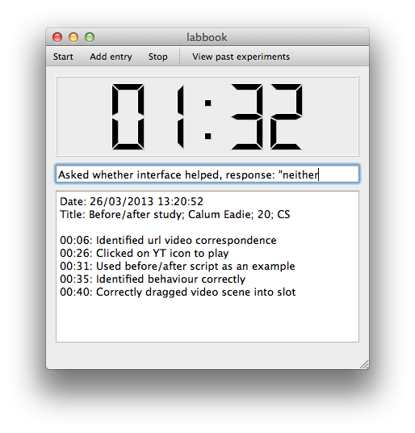
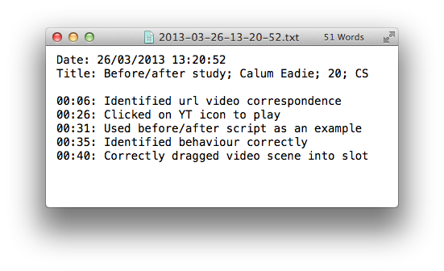

# labbook

A tool for **quickly** and **accurately** making **timestamped** notes.

## Motivation

Whilst running before/after and think aloud studies for my undergraduate dissertation I found it difficult to keep up with making notes through pen and paper. To help I used audio recordings so I could review later on. To be efficient I wanted to avoid listening through many hours of recordings. In this way I could avoid making detailed notes by hand however needed a way of marking notable sections of the recording and making brief notes.

This motivated a tool that would allow me **quickly** and **accurately** make **timestamped** notes. A digital lab notebook.

## Screenshots

### Running an experiment



### Experiment log



## Running

```sh
python labbook/labbook.py
```

## Dependancies

pyside - Python Qt bindings

```sh
# Debian derived linux
apt-get install python-pyside
# Mac
port install py-pyside
```

## License

labbook is licensed under a MIT license. See LICENSE.txt.
